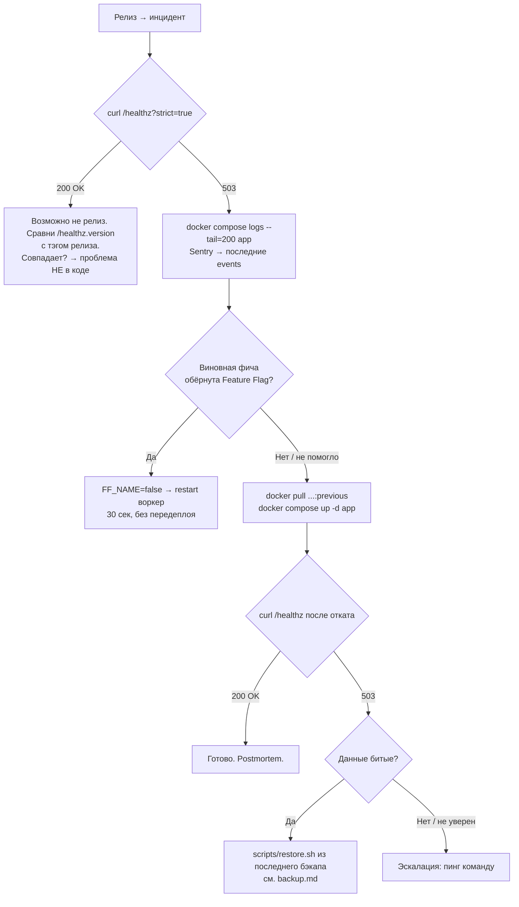

# Rollback runbook (#107)

> **Когда читать:** прод горит после релиза. **Ожидаемое время прочтения:** < 5 минут.
> **Ожидаемое время отката:** < 10 минут на тестовом окружении, ~3 минуты на проде.

## Decision tree



## Шаг 1 — Подтвердить что это инцидент

```bash
curl -sf "http://<prod>/healthz?strict=true" | jq .
```

| Ответ | Что значит | Действие |
|---|---|---|
| 200 + `status: ok` | Зависимости здоровы | Проблема не на нашей стороне (target DB? сеть?) |
| 503 + `status: degraded` | Хотя бы одна зависимость `down` | → шаг 2 |
| Connection refused | App вообще не отвечает | Сразу → шаг 4 (откат) |

Сверка версии:

```bash
curl -s http://<prod>/healthz | jq .version
# должна совпадать с git tag релиза
```

## Шаг 2 — Идентифицировать виновную фичу

Логи (последние 200 строк App-контейнера):

```bash
docker compose logs --tail=200 app
```

JSON-логи (`LOG_FORMAT=json`) фильтруются jq-grep'ом:

```bash
docker compose logs app | jq 'select(.level == "ERROR" or .level == "WARNING")'
```

Sentry: открой [Issues → последние 15 минут](https://sentry.io/) →
ищи всплеск exceptions с release tag = текущий релиз.

Цель — связать симптом с конкретной фичей. Если непонятно → шаг 4
(откат и разбираешься в спокойной обстановке).

## Шаг 3 — Попробовать выключить через feature flag

Если фича обёрнута `@require_flag("…")`:

```bash
# .env или docker-compose.override.yml:
FF_FORECAST=false
docker compose restart app
curl http://<prod>/api/forecast/users  # должно вернуть 404
```

Это самый дешёвый откат: минуты вместо часов, без редеплоя. Если
feature flag нет — переходи к шагу 4.

Какие фичи под флагами — `curl http://<prod>/admin/feature-flags`.

## Шаг 4 — Откат на предыдущий образ

```bash
docker pull ghcr.io/aleksandr-novikov/db-monitoring:previous
docker compose up -d app
```

Проверка:

```bash
# Версия должна смениться:
curl -s http://<prod>/healthz | jq .version

# Health-check:
curl -sf "http://<prod>/healthz?strict=true" || echo "still bad"
```

Если откат **не помогает** — проверь:
- Тэг `:previous` действительно указывает на ту версию что ты ждёшь (`docker inspect ...:previous | jq '.[0].Config.Env' | grep APP_VERSION`)
- Образ скачался (не cached старый): `docker image rm ...:previous && docker pull ...`

## Шаг 5 — Восстановление из бэкапа (если данные битые)

Делай **только** если:
1. Откат образа не помог
2. В логах/Sentry — ошибки про data corruption / constraint violations
3. Подтверждено что недавняя миграция (DROP, NOT NULL) повредила данные

→ Полный сценарий в [backup.md](./backup.md#восстановление).

Краткая версия:

```bash
docker compose stop app
RESTORE_URL=postgresql://... scripts/restore.sh backups/target-monitor-<latest-before-bad>.sql.gz
docker compose start app
curl -sf http://<prod>/healthz?strict=true
```

## Шаг 6 — Подтвердить + закрыть инцидент

После любого rollback-шага:

1. ✅ `curl /healthz?strict=true` → 200
2. ✅ Smoke API: `curl /api/notifications?limit=5` отдаёт payload
3. ✅ Sentry: новые errors прекратились (interval 15 мин)
4. ✅ Prometheus: `http_requests_total{status=~"5.."}` перестала расти
5. 📝 Postmortem в issue tracker: что было, что сделали, почему этой
   фичи нет под feature flag (если она должна быть)

## Ссылки

- [Backup runbook](./backup.md) — если нужен шаг 5
- [Feature flags README](../../README.md#feature-flags) — список фич за флагами
- [Релизы и Docker tags](../../README.md#релизы-и-откат-docker-tags) — как именно `:previous` обновляется
- `/admin/feature-flags` — текущее состояние флагов в проде
- `/healthz?strict=true` — глубокая проверка зависимостей

## Контакты

| Кто | Когда звонить |
|---|---|
| Sentry — owner проекта | Если события не приходят (sentry-sdk сломан в проде) |
| GHCR — кто пушит | Если `:previous` тэг указывает не туда (race в release workflow) |

> **Реgular dry-run:** хотя бы раз в квартал прогнать сценарий «откатить
> релиз» на staging. Без этого runbook гниёт молча.
